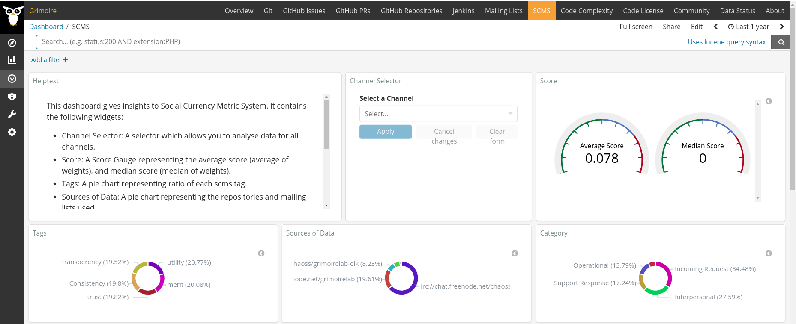
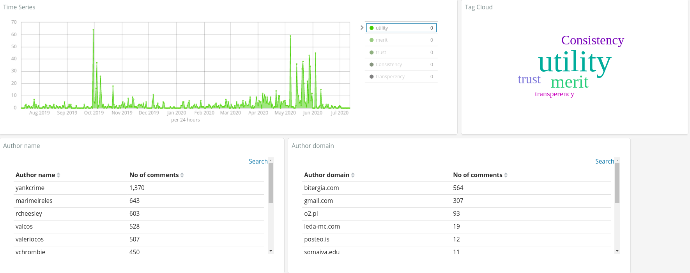

## STEPS

### STEP 1: ES to Google Sheets

1. Set up GrimpoireLab SirModred. ([Getting-Started](https://github.com/chaoss/grimoirelab-sirmordred/blob/master/Getting-Started.md#getting-started-)) 

2. According to the datasources to be analysed, Set `projects.json` and `setup.cfg` as mentioned [here](https://github.com/chaoss/grimoirelab-sirmordred#supported-data-sources-)

	A simple example could be: 
	1. Set `setup.cfg` as:
	
	```
		[scmspipermail]
		raw_index = scmspipermail_chaoss_raw
		enriched_index = scmspipermail_chaoss_enriched
		no-ssl-verify = true

		[scmsgithub]
		raw_index = scmsgithub_chaoss_raw
		enriched_index = scmsgithub_chaoss_enriched
		api-token = xxxx
		sleep-for-rate = true
		no-archive = true
		category = issue
		sleep-time = 300

		[scmssupybot]
		raw_index = scmssupybot_chaoss_raw
		enriched_index = scmssupybot_chaoss_enriched
	```

	

	2. Set `projects.json` as :

	```
	{
		"chaoss": {
			"scmsgithub": [
				"https://github.com/chaoss/grimoirelab-perceval",
				"https://github.com/chaoss/grimoirelab-elk"
				],
			"scmspipermail": [
				"https://lists.linuxfoundation.org/pipermail/grimoirelab-discussions/"
				],
			"scmssupybot": [
				"irc://chat.freenode.net/chaoss-community /irclogs/freenode/#chaoss-community",
				"irc://chat.freenode.net/grimoirelab /irclogs/freenode/#grimoirelab"
				]
			}
	}
	```

3. Enrich raw data by executing modred with the parameters as:

	`--enrich --panels --cfg ./setup.cfg --backends scmssupybot scmsgithub scmspipermail`

	(Here, add as many data sources you are using in SCMS)

4. Set alias:
	This step is important because we want to refer all (more than 1) SCMS indexes together. Here, in the example below, we have set alias as `all_scms` for 3 SCMS enriched indexes (`scmspipermail_chaoss_enriched`,`scmsgithub_chaoss_enriched`, `scmssupybot_chaoss_enriched`)

	```
	POST /_aliases
	{
	    "actions" : [
	        { "add" : { "index" : "scmspipermail_chaoss_enriched", "alias" : "all_scms" } },
	        { "add" : { "index" : "scmsgithub_chaoss_enriched", "alias" : "all_scms" } },
	        { "add" : { "index" : "scmssupybot_chaoss_enriched", "alias" : "all_scms" } }
	    ]
	}
	```

6. Install Dependencies:
	* `pip install gspread oauth2client`
	* `pip install openpyxl`

7. Set up `SCMS-creds.json` file with your credentials for using Google Sheet API. 

8. Execute a script `ES2GSheet` which will convert Elastic Search index(`all_scms`) into a Google Sheet.
(Output: Enriched data from Elastic Search is uploaded on Google Sheet).
	```
	cd utils/
	python3 ES2GSheet.py 
	```
We have set up our first basic instance for SCMS Implementation!

### STEP 2: Tagging & Codex formation:

1. Set up a codex, containing the definitions, use cases of all social currencies, categories.

2. Tag all records of the spreadsheet by adding 'category','weight', 'SCMS Tags' (You can add upto 5 SCMS tags: Tag 1, Tag 2, Tag 3, Tag 4, Tag 5)

The scms currencies are: `Transparency`, `Utility`, `Consistency`, `Merit`, `Trust`.

3. The Categories varies from 1 community to the other. 

4. Weight is also community dependent, there are many weighing scales, and methods that one can incorporate. We usually consider weight from `-3` to `+3`, where 

	- +ve weight = very relevant comment wrt the project, community
	- 0 weight = neutral relevance
	- -ve weight = completely irrelevant/ unnecessary discussion comments.

	You can also set Weight based on a Happiness method where
	- +ve weight = positive comment,
	- 0 weight = neutral, 
	- -ve weight = negative comment	

5. Keep the codex updated as the tagging proceeds.

### STEP 3: Google Sheet to Dashboard

1. Downlaod the Google Sheet as a CSV(.csv)- current file

2. Convert the CSV file to a JSON file using a script `GSheet2Dashboard`. 

		```
		cd utils/
		python3 utils/GSheet2Dashbaord.py
		```
		

3. Now, we need to execute a study `enrich_extra_data` to include the tagged information back to the Enriched index. The definition of this study can be found [here](https://github.com/chaoss/grimoirelab-elk/blob/master/grimoire_elk/enriched/enrich.py#L1066).
Enrich extra data by modifying the `setup.cfg` as below.

	```
	[scmspipermail]
	raw_index = scmspipermail_chaoss_raw
	enriched_index = scmspipermail_chaoss_enriched
	no-ssl-verify = true
	studies = [enrich_extra_data:scms]

	[scmsgithub]
	raw_index = scmsgithub_chaoss_raw
	enriched_index = scmsgithub_chaoss_enriched
	api-token = xxxx
	sleep-for-rate = true
	no-archive = true
	category = issue
	sleep-time = 300
	studies = [enrich_extra_data:scms]

	[scmssupybot]
	raw_index = scmssupybot_chaoss_raw
	enriched_index = scmssupybot_chaoss_enriched
	studies = [enrich_extra_data:scms]

	[enrich_extra_data:scms]
	json_url=https://gist.githubusercontent.com/ria18405/630346bac7856658fd19ed63bce4d9c0/raw/61d3afc8aab75219f8ab67218ec377a641cd664b/try.json
	```

4. Execute modred the same way as done above:
	
	`--enrich --panels --cfg ./setup.cfg --backends scmssupybot scmsgithub scmspipermail`

5. Click on 'SCMS' on the top menu icon, and enjoy the dashboard 
	
	

